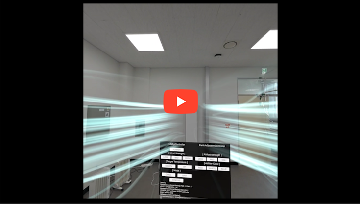
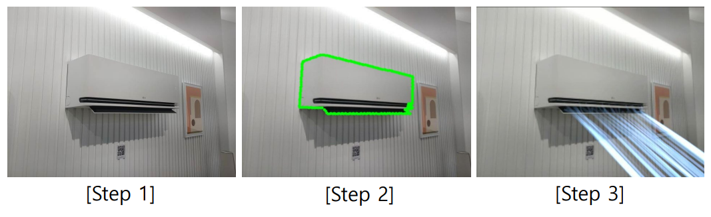
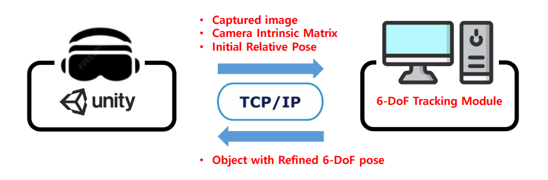

# AR Air Conditioner Pose Refinement on Meta Quest 3

This project implements an AR system that refines the 6DoF pose of a real-world air conditioner using passthrough images from Meta Quest 3 and visualizes airflow in first-person view.

## 🎮 Demo



ㄴYoutube link: [Watch Full Video](https://youtu.be/bawtqLYrZu0)

---

## Previous project...

A previous research project in the lab already demonstrated AR-based airflow visualization:

- Users manually placed a virtual air conditioner in the 3d reconstructed environment
- Airflow simulation was visualized based on the manually placed position

However, this approach had a key limitation:

👉 The virtual air conditioner was not accurately aligned with the real-world object.

## In this project...

This project was initiated with **two main objectives**:

1. Replace manual placement with **accurate 6DoF alignment** of the real air conditioner  
2. Extend the system from a tablet-based AR setup to a head-mounted display (**Meta Quest 3**)

This project focuses on integrating 6DoF object tracking into an AR system and deploying it on Meta Quest 3.
```text
What Already developed in previous project:
👉 Airflow simulation module (developed by a separate research team)
```
---

## ⚙️ Concept
1. Capture air conditioner image (passthrough)
2. Estimate **6-DoF** pose (3D translation, 3D rotation)
3. **Visualize airflow** based on the pose



### Major Challenges

- Household air conditioners are often **featureless objects**
- Reliable 6DoF estimation from a single image is difficult
- Real-time integration with AR systems requires:
  - camera pose handling
  - network communication
  - system-level synchronization

---

### My Contributions

This project extends the previous project by adding:

#### 1. Real-time 6DoF Object Tracking Integration
- Selected and adapted a DeepAC-based tracking approach
- Customized the pipeline to work with featureless air conditioners

#### 2. Unity + Meta Quest 3 Implementation
- Built the AR client using Unity on Meta Quest 3
- Implemented passthrough camera capture using Quest APIs

#### 3. Client-Server Communication
- Implemented TCP/IP communication between Unity and Python server
- Sent image + metadata to the tracking module
- Received refined 6DoF pose in real time
- Handled multiple coordinate systems (Unity, OpenCV) and implemented transformations across camera, world, and object coordinate frames.

#### 4. System Integration
- Applied refined pose to align the virtual air conditioner in Unity
- Connected pose updates to airflow visualization
- Integrated device control UI within the AR environment
- 
---

### Key Design Decision

Instead of fully automatic pose estimation:

- A coarse initial pose is provided by the user  
- The system performs **continuous pose refinement using image sequences**

This approach improves robustness in real-world environments with featureless objects.

---

## 🧱 System Architecture

This repository focuses on the **HMD (Unity / Meta Quest 3) side** of the system.




#### 🧩 Components

##### HMD (Unity - This Repository)
- Captures passthrough camera frames
- Extracts camera intrinsics and camera pose
- Sends data to server
- Receives refined pose
- Updates AR object alignment and visualization

##### Server (Python - Not included)
- Runs DeepAC-based 6DoF tracking module
- Refines pose using image sequence and initial pose
- Returns refined pose
- repo: https://github.com/jun617/DeepAC_withC2W

## 🔄 Major Pipeline

1. User places an approximate initial pose of the virtual AC  
2. Passthrough camera captures image frames  
3. Unity extracts:
   - image
   - camera intrinsics (fx, fy, cx, cy)
   - camera-to-world transformation  
4. Data is sent to Python inference server  
5. Server refines pose using image sequence tracking  
6. Refined pose is sent back to Unity  
7. Unity updates:
   - virtual AC model alignment  
   - airflow visualization  

## 📁 Project Structure

```text
Scripts/
└── MainScene/
    ├── Manager/
    │   ├── AC_APIController.cs
    │   ├── AirflowController.cs
    │   ├── AppFlowManager.cs
    │   ├── DebugLogger.cs
    │   ├── LoginController.cs
    │   ├── NetworkManager.cs
    │   ├── PassthroughManager.cs
    │   ├── TestManager.cs
    │   ├── TrackingManager.cs
    │   └── UIManager.cs
    ├── Network/
    │   ├── Client.cs
    │   └── CustomizedPacket.cs
    └── Singleton.cs
```

- `Manager/`: managers for UI flow, tracking, visualization, and testing
- `Network/`: TCP communication and packet abstraction
- `Singleton.cs`: generic singleton base class used across managers

## 🧩 Main Components

**1. AppFlowManager.cs**
```text
Manages high-level application states (login → setup → tracking → test).
```

**2. UIManager.cs**
```text
Implements state-driven UI management.  
Separates application logic (state) from presentation (UI).
```

**3. Client.cs**
```text
Handles TCP communication with the server.  
Detailed packet parsing is abstracted in the public version.
```

**4. NetworkManager.cs**
```text
Packages image frames and metadata for transmission to the server.
```

**5. TrackingManager.cs**
```text
Transforms refined pose into Unity world coordinates.  
Handles transition from initial placement to refined tracking and visualization.
```

**6. AirflowController.cs**
```text
Controls airflow visualization using simplified particle systems.
```

**7. PassthroughManager.cs**
```text
Captures passthrough frames and extracts camera intrinsics and pose.  
Optimized using frame sampling and texture reuse.
```

**8. TestManager.cs**
```text
Provides UI for testing system interaction and visualization control.
```

**9. Singleton.cs**
```text
Provides a reusable singleton pattern for global managers.
```

---

## 🔒 Public Version Notes

This repository is a cleaned version of the original research project.

The following components were removed or simplified:

- proprietary AC model asset → replaced with placeholder object  
- physics-based airflow simulation → replaced with simple particle system  
- external device API integration → removed  
- internal packet protocol details → abstracted  
- user study framework → not included  

## 🧪 Environment

```text
- Unity 2022.3.52f1  
- XR Plug-in Management: Oculus  
- Meta XR All-in-One SDK 72.0.0  
- Meta MR Utility Kit 72.0.0  
- Target device: Meta Quest 3  
```

---

## ❗ Limitations

Despite demonstrating a functional AR system, this project has several limitations:

### 1. Dependency on Initial Pose
The system requires a manually provided initial pose.
It does not perform fully automatic 6DoF pose estimation from scratch.

### 2. Server Dependency
The system relies on an external Python server for pose refinement.
This introduces latency and limits standalone deployment on the device.

## 🚀 Future Work

### 1. Fully Automatic Pose Initialization
Future work could focus on removing the need for manual initialization by improving robustness of initial 6DoF estimation for featureless objects.

### 2. Standalone On-Device Inference
Optimizing the tracking model for on-device inference (e.g., running directly on Meta Quest 3) would eliminate server dependency and improve latency.

### 3. Scene-Aware Simulation
Utilizing scene understanding (e.g., room geometry reconstruction) by using Scene API could enable airflow simulation that accounts for walls and obstacles.

### 4. User Study Integration
Extending the system to include structured user studies would allow quantitative evaluation of how AR airflow visualization affects user perception and decision-making.

---

## 📚 Acknowledgements

This project is part of a larger system that utilizes a customized version of a DeepAC-based 6DoF object tracking pipeline.

- Original repository: https://github.com/WangLongZJU/DeepAC  
- Related paper: Deep Active Contours for Real-Time 6DoF Object Pose Tracking (ICCV 2023)

In the full system, this tracking module is responsible for refining the 6DoF pose of the air conditioner using image sequences.

⚠️ Note:
The tracking module itself is not included in this repository.
This repository focuses on the Unity (Meta Quest 3) client and system integration.

- Customized version repository: https://github.com/jun617/DeepAC_withC2W

The original model was not trained from scratch in this project.
Instead, the tracking pipeline was adapted and integrated into the overall AR system,
including data handling, communication, and pose alignment in Unity.